<div align="center">
  
  <br/>
  <a href="#web-development"></a>
  <a href="#game-dev-unity"></a>
  <a href="#salesforce-dev"></a>
  <a href="#ai-and-ml"></a>
</div>

---

## About Me

```txt
Name       : Kshitij Kumar
Experience : 3+ years
Current    : Software Developer | Salesforce Developer
Focus      : Web Development, Salesforce, Game Dev, AI and ML
Mindset    : Building practical systems, clean user flows, and smarter automation
```

I am currently working as a Software Developer with hands-on experience across web technologies and Salesforce development. Alongside production work, I keep building in Unity and AI/ML so my roadmap stays balanced between enterprise systems, creative interaction, and intelligent products.

<div align="center">
  
</div>

---

## Web Development

<table>
  <tr>
    <td width="42%">
      
    </td>
    <td>
      I build responsive, production-ready web apps with clean component structure, reliable APIs, and interfaces that work smoothly across devices.
      <br/><br/>
      <b>Tech Stack</b><br/>
      
    </td>
  </tr>
</table>

<details>
  <summary><b>More About My Web Work</b></summary>
  <br/>
  I work on responsive layouts, reusable components, API integration, forms, dashboards, and frontend flows that stay clear on desktop and mobile.
</details>

---

## Game Dev (Unity)

<table>
  <tr>
    <td width="42%">
      
    </td>
    <td>
      I like creating interactive 3D gameplay, player systems, physics-driven mechanics, and game loops that feel fun instead of just functional.
      <br/><br/>
      <b>Tech Stack</b><br/>
      
    </td>
  </tr>
</table>

<details>
  <summary><b>More About My Game Dev Work</b></summary>
  <br/>
  I build Unity scenes, player controllers, gameplay mechanics, 3D interactions, physics-based behavior, and prototypes that can grow into complete game systems.
</details>

---

## Salesforce Dev

<table>
  <tr>
    <td width="42%">
      
    </td>
    <td>
      I work on Salesforce org customization, automation, and business workflows with a focus on clean configuration and scalable CRM delivery.
      <br/><br/>
      <b>Tech Stack</b><br/>
      
      
      
      
    </td>
  </tr>
</table>

<details>
  <summary><b>More About My Salesforce Work</b></summary>
  <br/>
  I work with Salesforce org setup, automation, Flows, Apex, Lightning Web Components, and CRM workflows that support real business operations.
</details>

---

## AI and ML

<table>
  <tr>
    <td width="42%">
      
    </td>
    <td>
      I explore machine learning, intelligent automation, and AI-assisted systems that turn data and workflows into smarter product experiences.
      <br/><br/>
      <b>Tech Stack</b><br/>
      
    </td>
  </tr>
</table>

<details>
  <summary><b>More About My AI/ML Work</b></summary>
  <br/>
  I explore model training, data processing, AI-assisted automation, prediction workflows, and practical ML features that can plug into real applications.
</details>

---

## GitHub Graphs

<div align="center">
  
</div>

---

## GitHub Timeline Snake

<div align="center">
  
</div>

---

<div align="center">

<a href="mailto:whkshitij13@gmail.com">
  
</a>

<a href="https://linkedin.com/in/kshitij-kumar-789a3632b">
  
</a>

</div>

<div align="center">
  
</div>
