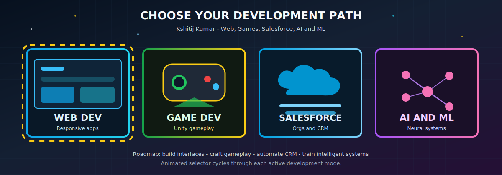

<!-- ========================================= -->
<!--      ARCADE PROFILE README + CAR MAP      -->
<!-- ========================================= -->

<div align="center">


</div>

---

## 🕹️ PLAYER CARD

<div align="center">
  
</div>

```txt
Name   : Kshitij Kumar
Role   : Software Developer @ Pricels
XP     : 3+ Years
Mode   : Full Stack | Cloud | AI | Game Dev
Status : Building real-world scalable systems
```

---

## 🚗 JOURNEY MODE

<div align="center">
  
</div>

<p align="center">
🚗 A real SVG car now moves across my tech world — Frontend City → Cloud City → AI Lab → Game Dev Arena
</p>

---

## 👾 MAIN CHARACTER

<div align="center">
  
</div>

```diff
+ Builds scalable full-stack applications 🚀
+ Designs cloud architecture ☁️
+ Creates AI-powered systems 🤖
+ Develops 3D games 🎮
+ Solves real-world engineering problems ⚡
```

---

## 🌍 GAME WORLD MAP

<div align="center">
  
</div>

### 🏙️ Frontend City
```diff
+ React ⚛️
+ Angular 🅰️
+ TypeScript 📘
+ Tailwind CSS 🎨
```

### ☁️ Cloud Kingdom
```diff
+ AWS (S3, Lambda, IAM) ☁️
+ Docker 🐳
+ Backend Systems 🚀
+ Architecture Design
```

### 🤖 AI Lab
```diff
+ Machine Learning 🧠
+ TensorFlow / PyTorch
+ Intelligent Automation
```

### 🎮 Game Dev Arena
```diff
+ Unity 🧊 → Chess 3D Game
+ Unreal Engine 🎯 → Survival Shooter
+ Gameplay + Physics + AI Systems
```

### 🏢 Enterprise Zone
```diff
+ Salesforce ⚙️
+ Production-grade applications
```

---

## 🧰 INVENTORY (TECH STACK)

<div align="center">

</div>

---

## 🤖 AI COMPANION

<div align="center">
  
</div>

```diff
+ Built AI-driven tools
+ Automated workflows
+ Intelligent systems design
```

---

## 🎮 BOSS LEVEL PROJECTS

<div align="center">
  
</div>

- 🧾 Dynamic Form Builder (AWS + Full Stack)
- ☁️ Pre-signed URL File Preview System
- 🤖 AI/ML Systems & Automation Tools
- ♟️ Chess 3D Game (Unity)
- 🔫 Survival Story Shooter (Unreal Engine)

---

## 📊 PLAYER STATS

<div align="center">


</div>

<div align="center">

</div>

---

## 🐍 SECRET LEVEL

<div align="center">

</div>

---

## 🎯 CURRENT QUESTS

```diff
+ Scaling cloud architecture ☁️
+ Deepening AI/ML expertise 🤖
+ Building immersive games 🎮
+ Optimizing backend performance ⚡
```

---

## 💬 NPC DIALOGUE

<div align="center">

</div>

---

## 📬 CONTACT PORTAL

<div align="center">

<a href="mailto:whkshitij13@gmail.com">
  
</a>

<a href="https://linkedin.com/in/YOUR_LINKEDIN">
  
</a>

</div>

---

## 🎞️ GAME OVER

<div align="center">

</div>
